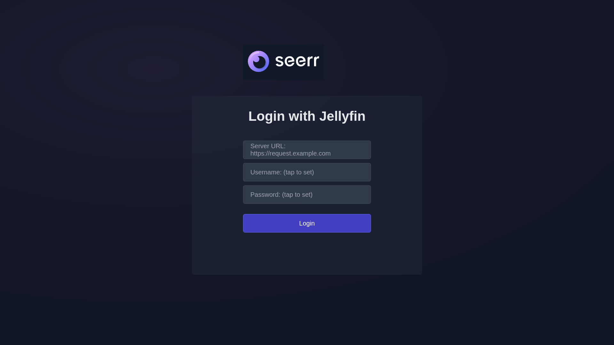
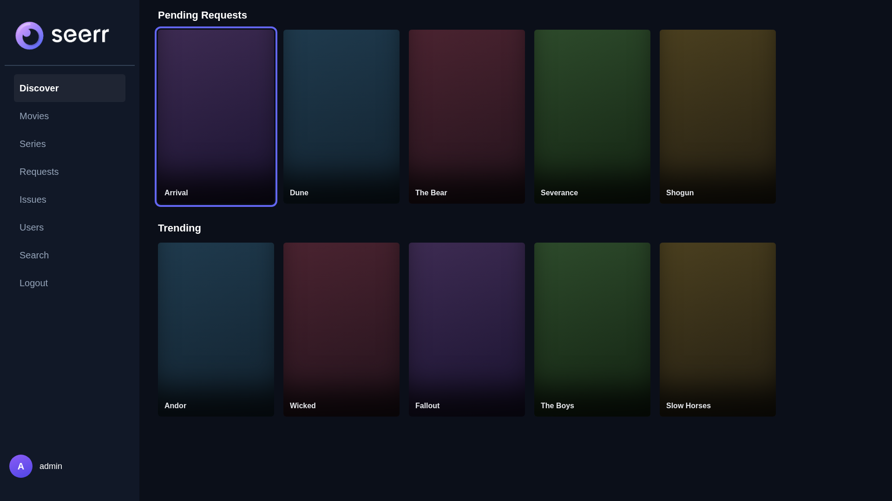

<div align="center">
  
  <h1>SeerrRoku</h1>
  <p>A native Roku client for your self-hosted Seerr (or Jellyseerr) instance.</p>
</div>

---

## 📖 Learn More

**SeerrRoku** brings the power of [Seerr](https://github.com/seerr-team/seerr) directly to your living room. Instead of pulling out your phone or opening a web browser to request a movie or TV show, you can now browse trending media, search for titles, and manage your requests seamlessly using your Roku remote.

**Requires Jellyfin-backed authentication.** This app logs in via your server's Jellyfin credentials, not a Plex or local account, so it needs a server with Jellyfin (or Emby) auth available:
- **[Seerr](https://github.com/seerr-team/seerr)** — the current, actively maintained project (Overseerr and Jellyseerr merged into it; both are now deprecated, sunset since May 2026). This is what you should deploy today if starting fresh. Seerr supports Plex, Jellyfin, and Emby — point this app at a Seerr instance connected to Jellyfin/Emby.
- **Jellyseerr** — the predecessor Jellyfin/Emby-native fork of Overseerr. Still works with this app if you haven't migrated yet, but it's deprecated upstream.
- **Plain Overseerr** (Plex-only, no Jellyfin support) — **not compatible.** Jellyfin auth was never a setting inside Overseerr itself; you need Seerr or Jellyseerr instead.

### 🖼️ Screenshots

> **Placeholders, not real device captures.** These are rendered mockups built from the actual SceneGraph layout/colors, not screenshots taken on a Roku — real captures are easy to get (see below) and these should be swapped for the genuine article. The login screen mockup predates the current inline-field login and doesn't reflect it yet.

| Login | Dashboard |
| --- | --- |
|  |  |

<details>
<summary>How to capture real screenshots from a Roku</summary>

With Developer Mode already enabled (see Installation below), Roku has a built-in capture tool — no extra software needed. Note this only captures the sideloaded app's own UI (screens like the ones above), not video/content playback.

- **From the browser:** open the same developer web installer page you use to sideload (`http://<roku-ip>`, logged in as `rokudev`) — there's a **Screenshot** link that captures and downloads the app's current screen.
- **From the command line** (requires the same `rokudev` credentials as the web installer — the dev web server rejects unauthenticated requests). Passing just the username makes `curl` prompt for the password interactively, so it's never typed into a command or a file:
  ```bash
  curl -u rokudev -d '' http://<roku-ip>:8060/plugin_inspect
  curl -u rokudev http://<roku-ip>:8060/pkgs/dev.jpg -o screenshot.jpg
  ```
  Navigate to the screen you want first, then run both commands (each will ask for the dev password once).

</details>

### ✨ Features
* **Discover Dashboard:** Browse trending movies, upcoming TV shows, and recommendations natively on your TV.
* **Search:** Search the full TMDB library directly from your Roku using the standard Roku keyboard interface.
* **Request Media:** Request new movies and TV shows, or approve/deny pending requests if you are an administrator.
* **Issue Reporting:** Report video, audio, or subtitle issues directly from the media detail screen.
* **Secure Authentication:** Connects directly and securely to your self-hosted instance without routing through any third-party telemetry servers.

---

## 🚀 Installation & Sideloading

Since this app connects to self-hosted instances and is a third-party client, it must currently be sideloaded onto your Roku device. 

### Step 1: Enable Developer Mode on your Roku
Grab your Roku remote and enter the following sequence rapidly to open the Developer Settings screen:
1. **Home** (x3)
2. **Up** (x2)
3. **Right** -> **Left** -> **Right** -> **Left** -> **Right**

Follow the on-screen prompts to enable Developer Mode. It will ask you to set a webserver password. Make sure to write down the **IP Address** and **Password** it gives you!

### Step 2: Download the App
Download the latest `seerr-roku-vX.Y.Z.zip` release package from the [Releases](../../releases) tab on this GitHub repository (or build it from source).

### Step 3: Install the App
1. Open a web browser on your computer or phone (must be on the same local network as your Roku).
2. Type in your Roku's IP address (e.g., `http://192.168.0.45`).
3. Log in with the username `rokudev` and the password you created in Step 1.
4. Click **Upload** and select the `seerr-roku-vX.Y.Z.zip` file you downloaded.
5. Click **Install**. 

The app will immediately launch on your TV!

---

## ⚙️ Configuration

When you launch SeerrRoku for the first time, you will be presented with a login screen.
1. **Server URL:** Enter the full URL to your Seerr or Jellyseerr instance (e.g., `https://request.mydomain.com`). Make sure to include `http://` or `https://`. If you use `http://`, you'll be shown a warning before your credentials are sent unencrypted — `https://` is strongly recommended.
2. **Username & Password:** Enter your **Jellyfin** sign-in credentials (the same ones you use to log into Jellyfin itself) — not a Plex or local Seerr/Overseerr account.
3. **Save credentials on this device:** A toggle button, ON by default. Leave it ON to skip re-entering your server URL and username next time you launch the app; switch it OFF if this is a shared or borrowed Roku and you'd rather nothing survive after you close the app.

The app securely stores your server URL, username, and session token locally on your Roku's registry and connects directly to your server. Your password is never stored. Logging out via the Dashboard's Logout option clears all of it immediately; if "Save credentials on this device" is OFF, it's also cleared automatically as soon as you close the app, even without logging out first.

---

## ⚖️ Legal & Privacy

* **Privacy:** This application does not collect, store, or transmit any telemetry or personal data to the developer. All communication is strictly between your Roku device and your self-hosted server. Please review our [Privacy Policy](docs/PRIVACY_POLICY.md) for more details.
* **Terms of Use:** This is an unofficial, third-party client. It is provided "as is" and is not officially affiliated with Seerr, Jellyfin, or Roku Inc. Please review our [Terms of Use](docs/TERMS_OF_USE.md).
